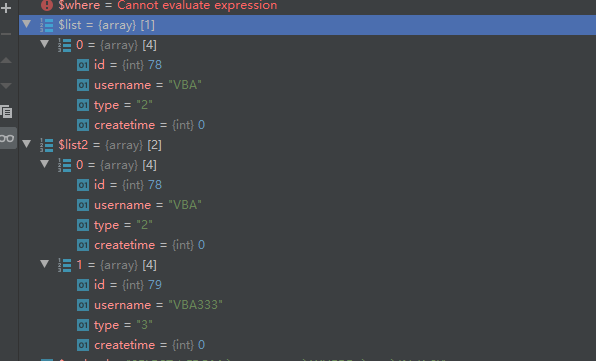

**一条神奇的sql**   
        个人有一个习惯，喜欢在查询的时候把sql也打印出来去数据库执行一下，看是否预期一致。

本次问题环境：
 mysql5.7 php7.3.4nts thinkphp5.1 redis5.0.5
    
出现的问题现象
    就是上面那个习惯，让我在工作的时候发现一个神奇的现象，

**使用tp的查询构造器方法和原生的query传sql方法获得的数据集不一致。**

    
    进一步观察可以看的出来，$list才是我们所预期的数据集 ，而$list2就。。。
    

可还原数据支持

CREATE TABLE `xn_my_enum` (
  `id` int(10) unsigned NOT NULL AUTO_INCREMENT COMMENT 'ID',
  `username` varchar(30) COLLATE utf8mb4_unicode_ci NOT NULL DEFAULT '' COMMENT '名字',
  `type` enum('2','3','9','6') COLLATE utf8mb4_unicode_ci NOT NULL DEFAULT '2' COMMENT 'type',
  `createtime` int(10) unsigned DEFAULT '0' COMMENT '时间',
  PRIMARY KEY (`id`)
) ENGINE=InnoDB AUTO_INCREMENT=1 DEFAULT CHARSET=utf8mb4 COLLATE=utf8mb4_unicode_ci COMMENT='神奇的sql测试表';

**_SELECT * FROM `xn_my_enum` WHERE  `type` IN (1,2);_**

INSERT into `xn_my_enum`(username,type) VALUES('VBA','2'),('VBA333','3'),('VBA6','6'),('VBA9','9');

解决问题的过程
    
    同一预期的sql通过不同的方法而展现出不同的结果集，称之为一条神奇的sql。
    出现这种情况，基本就是框架tp的锅了，或者说是代码不规范和数据库表设计不合理。
    查看数据库表结构可以发现，type为enum类型，而且顺序为2，3，9，6
    枚举原理：枚举在进行数据规范的时候（定义的时候），系统会自动建立一个数字与枚举元素的对应关系（关系放到日志中）；
            然后在进行数据插入的时候，系统自动将字符转换成对应的数字存储，
            然后在进行数据提取的时候，系统就自动将数字转换成字符串显示。
    那么数字与枚举元素的对应关系
    

解决方案

总结||大家的一些唠叨